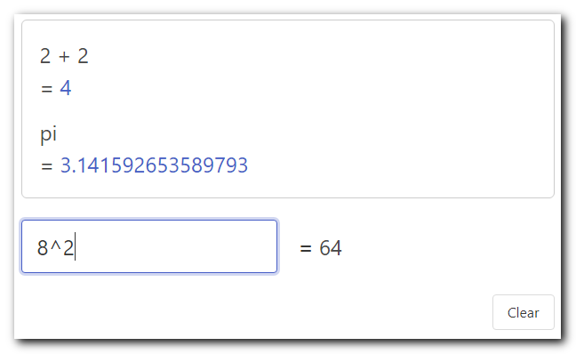

# Text-based calculator with history

A simple, text-based calculator to do quick arithmetic. Aims to be a simplified, online version of [SpeedCrunch](https://speedcrunch.org/) or PowerToys PowerCalc.

## Usage

* Type an expression and see the results immediately.
* In the expression field:
    * Type Enter to store the expression and result in the results history.
    * Type the up arrow to show the most recent expression.
    * Type the down arrow or Esc to clear the current expression.
    * Type an operator to use the previous answer (e.g. +2 will add 2 to the previous answer).
    * Type 'c' or hit the Clear button to clear all of the fields.

[Try it out here](https://calc.danhersam.com/).

## Credits

* Built with [Math.js](https://mathjs.org/), [Vue.js](https://vuejs.org/) and [Bulma](https://bulma.io/)
* Favicon from [Icons8](https://icons8.com/icon/23154/calculator)

## Updating dependencies

* Vue - Download the [latest production version](https://vuejs.org/js/vue.min.js) and rename it with the version.
* Math.js - Download the [latest version](https://unpkg.com/mathjs@latest/lib/browser/math.js) and rename it with the version.
